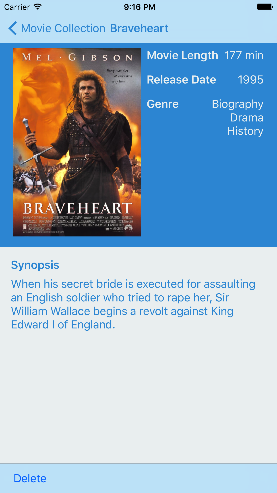

# MoviesApp
This is a pet project whose main goal is to use MVVM without frameworks, Alamofire, SwiftyJSON and ImageLoaderSwift

## Screens

### Login Screen

### Register Screen

### Movie Collection Screen

### Movie Detail Screen

### Create Movie Screen

